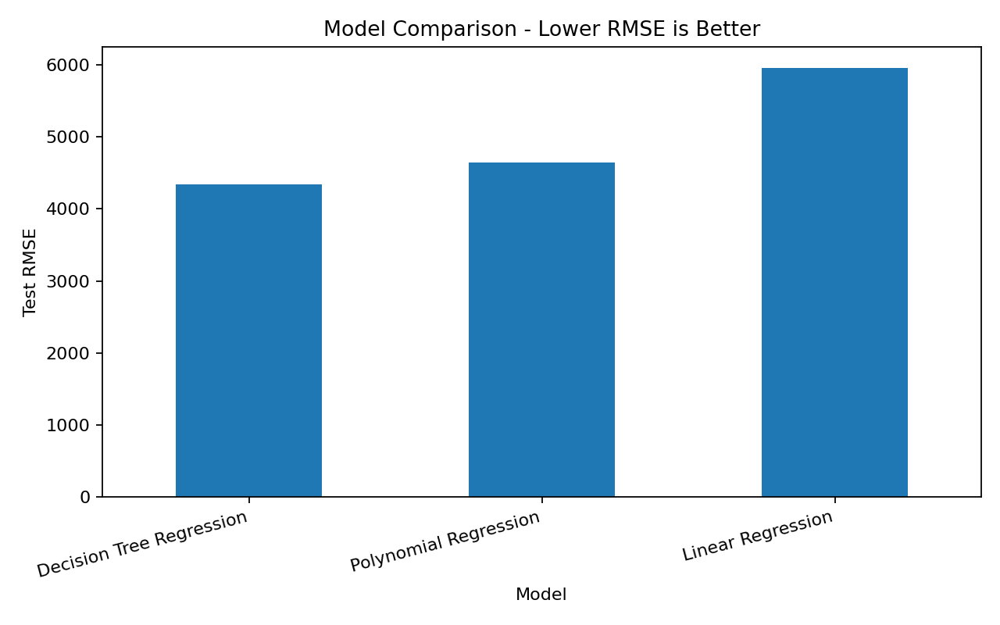
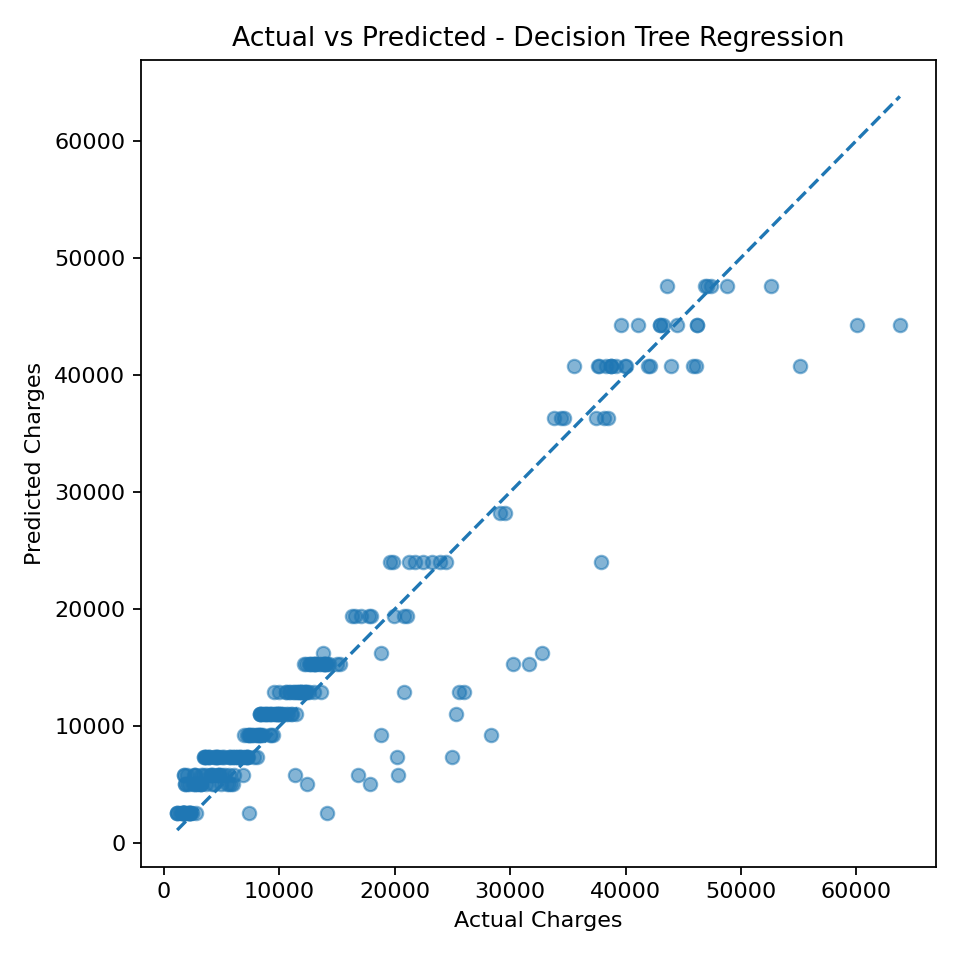
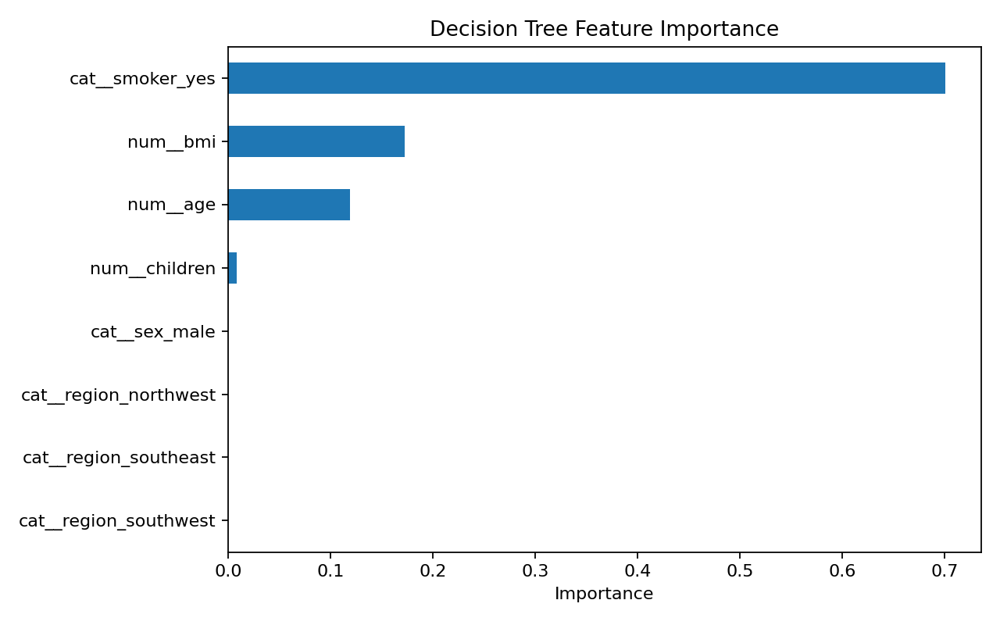
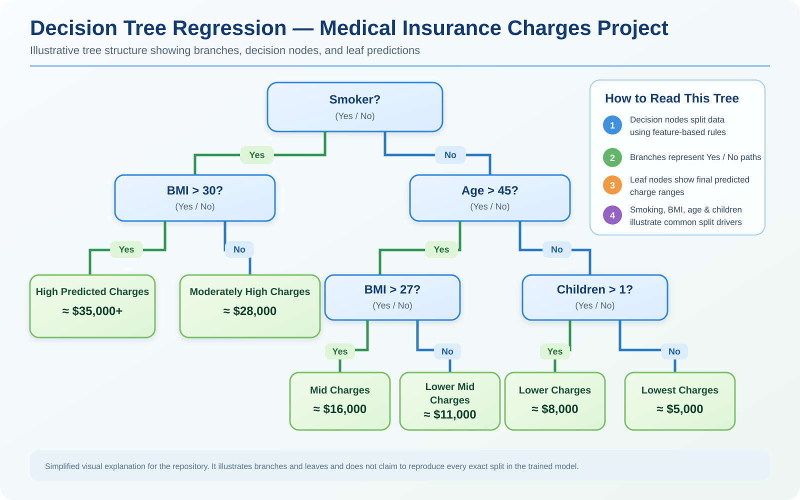

# 🏥 Medical Insurance Charges Regression


End-to-end machine learning portfolio project for predicting medical insurance charges with **Linear Regression**, **Polynomial Regression**, and **Decision Tree Regression**.

The repository demonstrates a complete data science workflow: data cleaning, exploratory data analysis, leakage-safe preprocessing, cross-validation, hyperparameter tuning, model comparison, interpretation, business analysis, model persistence, reporting, and deployment with Streamlit.

> **Portfolio focus:** reproducible machine learning, transparent model comparison, business interpretation, deployment, and recruiter-friendly documentation.

## 🚀 Live Demo

**Streamlit App:** https://medical-insurance-charges-regression.streamlit.app/

**GitHub Repository:** https://github.com/mightyalok00/medical-insurance-charges-regression

---

## 👔 Recruiter Snapshot

- Built and evaluated **3 regression models** using a leakage-safe scikit-learn workflow.
- Cleaned the dataset from **1,338 to 1,337 records** by removing one exact duplicate; no missing values remained.
- Used **5-fold cross-validation** and training-only model selection before final holdout evaluation.
- Achieved **Test R² = 0.8972** and **Test RMSE = 4,345.88** with the tuned Decision Tree model.
- Reduced RMSE by approximately **27% versus the Linear Regression baseline**.
- Deployed an interactive **Streamlit dashboard** with model selection, three-model prediction comparison, business insights, filtering, and downloadable outputs.

---

## 🧰 Tech Stack

| Area | Tools / Skills |
|---|---|
| Language | Python |
| Data Analysis | pandas, NumPy |
| Machine Learning | scikit-learn |
| Models | Linear Regression, Polynomial Regression, Decision Tree Regression |
| Validation | Train/Test Split, 5-Fold Cross-Validation, Hyperparameter Tuning |
| Evaluation | MAE, MSE, RMSE, R² |
| Visualization | Matplotlib, Altair |
| Deployment | Streamlit |
| Model Persistence | joblib |
| Development | Jupyter Notebook, Git, GitHub |
| ML Practices | Pipelines, One-Hot Encoding, Leakage Prevention, Reproducibility |

---

## 🎯 Project Objective

Predict the target variable `charges` using:

- `age`
- `sex`
- `bmi`
- `children`
- `smoker`
- `region`

The project compares three regression approaches to show the trade-off between **simplicity, interpretability, nonlinear modeling, and predictive performance**.

---

## 📌 Executive Summary

| Item | Result |
|---|---|
| Original dataset | **1,338 rows** |
| Cleaned dataset | **1,337 rows** |
| Exact duplicates removed | **1** |
| Missing values | **None found** |
| Train/test split | **80/20** |
| Cross-validation | **5-fold** |
| Models trained | **3** |
| Metrics | **MAE, MSE, RMSE, R²** |
| Strongest saved holdout performer | **Decision Tree Regression** |
| Reproducibility | `random_state=42` |

The final test set is kept untouched during model selection and tuning. Preprocessing remains inside scikit-learn pipelines to reduce leakage risk.

---

## 📊 Three-Model Comparison

All three models use the same final holdout split.

| Model | Test MAE | Test MSE | Test RMSE | Test R² |
|---|---:|---:|---:|---:|
| **Decision Tree Regression** | **2,621.31** | **18,886,631.25** | **4,345.88** | **0.8972** |
| Polynomial Regression | 2,867.32 | 21,585,843.72 | 4,646.06 | 0.8825 |
| Linear Regression | 4,177.05 | 35,478,020.68 | 5,956.34 | 0.8069 |

Source: `reports/model_comparison.csv`

### Model-selection conclusion

For this dataset and saved holdout evaluation, **Decision Tree Regression produced the strongest predictive results** because it has the lowest MAE, MSE, and RMSE and the highest R² among the three models.

Compared with Linear Regression:

- Polynomial Regression reduces Test RMSE by about **22%**.
- Decision Tree Regression reduces Test RMSE by about **27%**.

This suggests that nonlinear relationships and feature interactions are important in the dataset.

> “Strongest” refers only to this project's saved holdout metrics. A production model would still require external validation, monitoring, fairness testing, domain review, and stability checks.

---

## 📈 Portfolio Visuals

### Model comparison



### Actual vs predicted charges



### Decision Tree feature importance



### Decision Tree branches and leaves — visual explanation

The diagram below explains the basic structure of a Decision Tree Regression model using **decision nodes**, **Yes/No branches**, and **leaf nodes** that output predicted insurance-charge ranges.



> **Note:** This is a simplified educational visualization for the portfolio. It explains how branches and leaf nodes work and does not claim to reproduce every exact split of the trained Decision Tree model.

These visuals make the model performance and interpretation easy to review without opening the notebook first.

---

## 🧠 Model Interpretation

### Linear Regression

A simple and transparent baseline. It is easy to explain but does not capture all nonlinear structure in the data.

### Polynomial Regression

A nonlinear extension of the linear baseline. It improves predictive performance by modeling interactions and nonlinear effects while retaining a regression form.

### Decision Tree Regression

The strongest saved holdout performer. It naturally captures thresholds and interactions without manual polynomial expansion. The project uses tuning and cross-validation to control complexity.

A dedicated branches-and-leaves explainer is included at `images/decision_tree_regression_explained.svg` and is also displayed inside the Streamlit **Drivers & Insights** tab.

---

## 🔮 Streamlit Dashboard

The root-level `app.py` provides a professional interactive dashboard with:

- **Executive Overview**
- **Prediction Lab**
- **Model Performance**
- **Drivers & Insights**
- **Data Explorer**
- **Project Files**

### 🧠 Model selector

The left sidebar contains an always-visible prediction model selector with:

- `Compare all models`
- `Linear Regression`
- `Polynomial Regression`
- `Decision Tree Regression`

The selection controls the **Prediction Lab** tab. When `Compare all models` is selected, the app shows predictions from all successfully loaded models in a comparison table and chart. When a single model is selected, the app displays that model's prediction and descriptive cost band.

### 🎛️ Dataset filters

The sidebar includes filters for:

- 🎂 Age
- ⚖️ BMI
- 👶 Children
- 🚻 Sex
- 🚬 Smoker status
- 📍 Region

The filtered dataset updates dashboard metrics and visualizations, and users can download the current filtered data as CSV.

---

## 💡 Key Business Findings

- Smokers have substantially higher observed mean charges than non-smokers in this dataset.
- Age and BMI show meaningful relationships with charges.
- Nonlinear models outperform the simple Linear Regression baseline on the saved holdout set.
- Predicted-cost quartiles support descriptive segmentation.
- Region, sex, and number of children show smaller descriptive differences than smoking status in this sample.

These are **predictive/associational findings, not causal claims**.

The project is for education and portfolio demonstration only and should not be used for real insurance pricing, underwriting, eligibility, or adverse-action decisions without actuarial, legal, regulatory, fairness, temporal, and external validation.

---

## 🔄 Machine Learning Workflow

```text
Raw Data
   ↓
Data Quality Checks
   ↓
Cleaning & EDA
   ↓
Feature / Target Separation
   ↓
80/20 Train-Test Split
   ↓
Leakage-Safe Pipelines
   ↓
Linear Regression
Polynomial Regression
Decision Tree Regression
   ↓
5-Fold Cross-Validation / Tuning
   ↓
Untouched Final Test Evaluation
   ↓
MAE / MSE / RMSE / R² Comparison
   ↓
Interpretation & Business Analysis
   ↓
Saved Models + Reports + Streamlit App
```

---

## 🛡️ Leakage Prevention & Reproducibility

- `charges` is excluded from the feature matrix.
- preprocessing stays inside scikit-learn pipelines.
- categorical variables are handled with pipeline-based encoding.
- polynomial degree selection uses training-only validation.
- Decision Tree tuning uses training-only validation.
- the final holdout test set is reserved for final evaluation.
- `random_state=42` is used where applicable.

---

## 🔎 Skills Demonstrated / ATS Keywords

**Python, pandas, NumPy, scikit-learn, Machine Learning, Data Science, Regression, Linear Regression, Polynomial Regression, Decision Tree Regression, Exploratory Data Analysis, EDA, Data Cleaning, Data Preprocessing, Feature Engineering, One-Hot Encoding, Train-Test Split, Cross-Validation, Hyperparameter Tuning, Model Evaluation, MAE, MSE, RMSE, R², Model Comparison, Feature Importance, Pipelines, Data Leakage Prevention, Reproducibility, Business Analysis, Model Interpretation, Streamlit, Jupyter Notebook, Git, GitHub, joblib, Deployment.**

---

## 📁 Project Structure

```text
medical-insurance-charges-regression/
├── app.py
├── README.md
├── requirements.txt
├── .gitignore
├── LICENSE
├── .streamlit/
│   └── config.toml
├── data/
│   ├── raw/insurance.csv
│   └── processed/insurance_cleaned.csv
├── notebooks/
│   └── insurance_model_training.ipynb
├── src/
│   ├── preprocessing.py
│   ├── train_models.py
│   ├── evaluate_models.py
│   └── utils.py
├── models/
│   ├── linear_regression.pkl
│   ├── polynomial_regression.pkl
│   └── decision_tree_regression.pkl
├── reports/
│   ├── model_comparison.csv
│   ├── model_diagnostics.csv
│   ├── cross_validation_results.csv
│   ├── linear_regression_coefficients.csv
│   ├── polynomial_regression_coefficients.csv
│   ├── decision_tree_feature_importance.csv
│   ├── predicted_cost_segments.csv
│   ├── question_coverage_checklist.csv
│   ├── project_report.md
│   └── project_report.pdf
├── images/
│   ├── decision_tree_regression_explained.svg
│   ├── model_comparison.png
│   ├── actual_vs_predicted.png
│   └── feature_importance.png
└── docs/
```

---

## ✅ Assignment Coverage

All **17 project requirements** are covered, including dataset structure, cleaning, categorical encoding, EDA, smoker analysis, leakage prevention, all three regression models, metric comparison, interpretation, loop-based training, professional folder structure, deep business analysis, complete three-model comparison, cross-validation, and hyperparameter tuning.

See `reports/question_coverage_checklist.csv` for the detailed audit.

---

## 💼 Resume-Ready Project Summary

**Medical Insurance Charges Regression | Python, scikit-learn, Streamlit**

- Built and compared Linear, Polynomial, and Decision Tree regression pipelines on **1,337 cleaned insurance records** using leakage-safe preprocessing and **5-fold cross-validation**.
- Achieved **R² = 0.8972** and **RMSE = 4,345.88** with the tuned Decision Tree model, reducing RMSE by approximately **27% versus the Linear Regression baseline**.
- Developed model interpretation, feature-importance analysis, business segmentation, and reproducible evaluation using **MAE, MSE, RMSE, and R²**.
- Deployed an interactive **Streamlit** application for model selection, multi-model prediction comparison, dataset filtering, and business insights.

A dedicated copy-ready version is available in `docs/RESUME_PROJECT_ENTRY.md`.

---

## ▶️ Run Locally

```bash
git clone https://github.com/mightyalok00/medical-insurance-charges-regression.git
cd medical-insurance-charges-regression
python -m venv .venv
```

Windows:

```bash
.venv\Scripts\activate
pip install -r requirements.txt
streamlit run app.py
```

Notebook:

```bash
jupyter notebook notebooks/insurance_model_training.ipynb
```

---

## 📦 Saved Deliverables

- three trained `.pkl` pipelines
- executed Jupyter notebook
- cleaned dataset
- model comparison and cross-validation results
- coefficient and feature-importance reports
- predicted-cost segmentation output
- Markdown and PDF project reports
- visualization images
- professional Streamlit dashboard
- assignment coverage checklist
- supporting documentation

---

## 🧾 Conclusion

This project demonstrates a complete regression workflow from raw data through model evaluation and deployment.

**Linear Regression** provides a transparent baseline. **Polynomial Regression** improves performance by capturing nonlinear effects and interactions. **Decision Tree Regression** achieves the strongest saved holdout performance, with the lowest error metrics and highest R² among the three models.

For this dataset and evaluation setup, the tuned **Decision Tree Regression** is the strongest predictive model of the three. Model choice in a real production setting would still need to balance predictive accuracy with interpretability, stability, fairness, operational constraints, and validation on new data.

---

## 👤 Author

**Alok Agarwal**

GitHub: https://github.com/mightyalok00

Live App: https://medical-insurance-charges-regression.streamlit.app/
